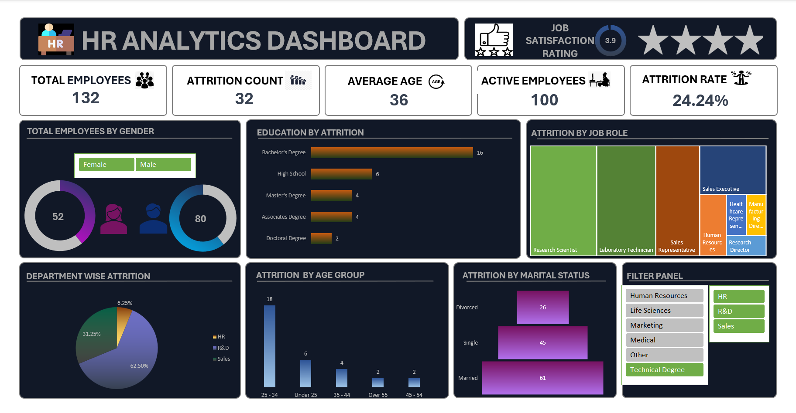

# 📊 HR Analytics Dashboard

## 🔍 Overview

An **interactive Excel dashboard** designed to analyze employee attrition, workforce trends, and key HR metrics.
This project helps in understanding employee behavior and supports **data-driven HR decision-making**.

---

## 📷 Dashboard Preview



---

## 📊 Features

* 📉 Attrition Analysis
* 👥 Gender Distribution
* 🏢 Department-wise Insights
* 🎯 Age Group Analysis
* 💼 Job Role Analysis
* 🎛️ Interactive Filters & Slicers

---

## 🛠️ Tools Used

* Microsoft Excel
* Pivot Tables
* Pivot Charts
* Slicers

---

## 📂 Project Structure

```
HR-Analytics-Dashboard/
│── Data/
│   └── HR DATA_Excel.xlsx
│── Images/
│   └── Dashboard.png
│── README.md
```

---

## 🚀 How to Use

1. Download the Excel file from the **Data** folder
2. Open it in Microsoft Excel
3. Use filters and slicers to explore insights

---

## 💡 Key Insights

* Attrition trends across departments
* Impact of job roles and education on attrition
* Workforce distribution by age and gender

---

## 👤 Author

**Kunal Chandelkar**
🎯 Aspiring Data Analyst
💻 Excel | SQL | Data Visualization

---

## ⭐ Support

If you found this project useful, consider giving it a ⭐ on GitHub!
